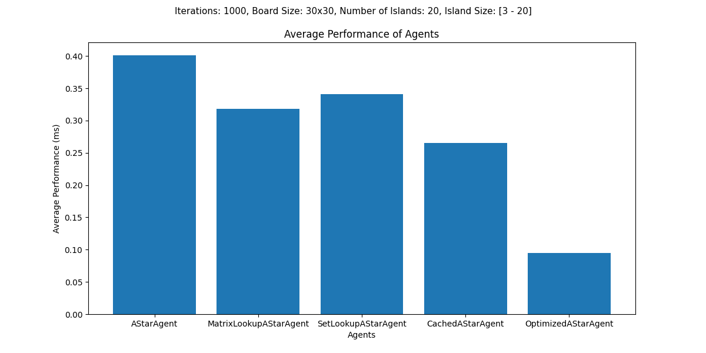

# Single Agent Pathfinding Optimizations
## Author: Peter Olsen

This project was written for CSCI 4511W at the University of Minnesota - Twin Cities. The purpose of this project
is to find a way to optimize single agent pathfinding algorithms. All code was written by myself, with algorithms being constructed from pseudocode and procedural explanations in research papers.
    
### Instructions

This project has two dependencies outlined in the requirements.txt file: matplotlib for data visualization and pygame for the agent simulation module. 
This project contains two main modules:
- Simulation
- Testing

The simulation module allows users to view the searching process in real time, and the testing module allows for users to compare the difference in performance between agents, using predefined graphing methods.

To run the simulation, one can run the ```main(agent)``` function in the __main.py__ file, passing in a given agent class to the function. This will display a board and run the search process, which can be restarted with a new board by clicking on the screen. The board will appear similar to the following figure, with the agent being represented as a solid dot and the goal state as a ring.

<p align="center">
    
</p>

To run the testing portion, one must modify the ```main()``` method in the __testing.py__ file. There are three important parts to modify:
- The list of agents to be tested
- The board on which they are tested
- The graphs which are produced once the testing is complete

Once this is all defined, running the main method will produce visualizations of the testing process in one of many subdirectories in the __/test_results__ directory.

### Results

The results of this experiment found that the most consistent method of improving agent performance was through the inclusion of a cache to store previously calculated heuristic values. Various graphs will be included below.

### Tests over increasing board size

These graphs are by far the most insightful, since they encapsulate 3,000 test iterations over various different board sizes. That way, they can display the differences in agent performance as board sizes changes.


### Average Performance Times for A* Search on Small - Large boards

These graphs are not as exhaustive as the increasing board size graphs, but they demonstrate the difference in agent performance across different board sizes.




### Average Performance Times for Local Search on Small - Large boards


